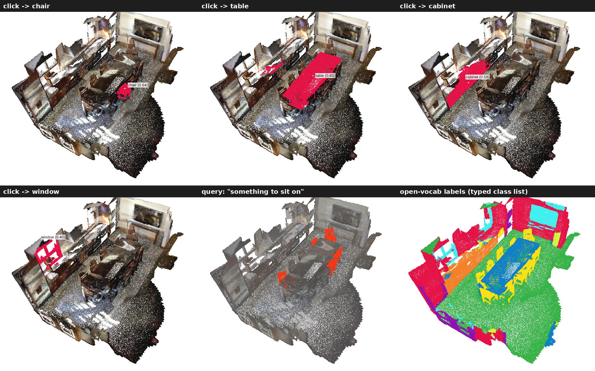

# OpenSNAP: Open-Vocabulary Segment-Anything for Point Clouds

OpenSNAP turns [SNAP](https://github.com/neu-vi/SNAP) (promptable point-cloud segmentation, closed-vocabulary text head) into an **open-vocabulary** model: click an object in any point cloud, get its mask **and its name** — no training.

It combines three sources of evidence:

1. **SNAP** — class-agnostic promptable masks + SNAP's own CLIP-space text token.
2. **OpenScene** — per-point CLIP features from the 3D distilled model ([OpenScene](https://github.com/pengsongyou/openscene), point cloud only at inference).
3. **A small VLM** (Qwen2.5-VL-3B/7B) looking at renders of the segmented object.

## What is new

| Component | Idea |
|---|---|
| **Mask-Anchored Pooling** | Average OpenScene features inside each SNAP mask (weighted by mask probability) → one CLIP embedding per object. Point labels are an IoU-weighted vote over overlapping masks, blended with the dense prediction (`beta`). |
| **Dual-Expert Fusion** | Product-of-experts of the pooled OpenScene embedding and SNAP's text token (`alpha`). The two live in different CLIP spaces, so fusion is done on class posteriors. |
| **Vocabulary Relay** | SNAP's text head was trained with CE against a fixed vocabulary, so its token is best read *through* that vocabulary: posterior over training anchors × CLIP text-text similarity of anchors to the new query. |
| **Render-Ask-Verify / 3D-Propose-VLM-Choose** | Object-centric renders (real-color context, red outline, occluders culled). *RAV*: the VLM names freely, 3D evidence re-ranks VLM names ∪ top 3D names. *Choose*: 3D proposes top-5 names from an open prior vocabulary, the VLM scores them as multiple-choice (letter log-probs), log-linear fusion. |

## Results

All numbers produced by the scripts in this repo on this machine. Hyper-parameters were tuned on 40 **ScanNet train** scenes (`results/tune`); the VLM render style/mode was picked on a ScanNet-val subset (143 clicks).

### Open-vocabulary 3D semantic segmentation (OpenScene protocol, 1 run, prompt `a {} in a scene`)

**ScanNet val (312 scenes, 20 classes, LSeg 3D features)**

| method | mIoU | mAcc | allAcc |
|---|---|---|---|
| OpenScene 3D-distill (reproduced) | 52.0 | 63.1 | 80.2 |
| SNAP text token (masks + token) | 38.5 | 51.9 | 76.3 |
| + Mask-Anchored Pooling | 55.5 | 65.1 | 82.9 |
| Dual-Expert w/o relay | 54.4 | 64.0 | 83.1 |
| **OpenSNAP (full)** | **55.9** | **65.2** | **83.5** |

**Matterport3D test, 160 classes (406 regions, OpenSeg 3D features)** — *unseen* = the 63 classes not in SNAP's training vocabulary

| method | mIoU | mAcc | allAcc | mIoU seen | mIoU unseen |
|---|---|---|---|---|---|
| OpenScene 3D-distill (reproduced) | 9.5 | 15.4 | 53.6 | 12.0 | 5.5 |
| SNAP text token | 6.5 | 10.2 | 65.0 | 9.5 | 1.8 |
| + Mask-Anchored Pooling | 9.9 | 15.2 | 57.4 | 12.6 | 5.5 |
| **OpenSNAP (full)** | **11.1** | **16.2** | **69.0** | **14.9** | 5.2 |

OpenSNAP improves OpenScene by **+3.9 mIoU** on ScanNet and **+1.6 mIoU / +15.4 allAcc** on Matterport-160. Gains come from seen classes; on unseen Matterport classes the method is on par with OpenScene (not better).

### Click-to-name (single simulated click → SNAP mask → free-form name)

Clicks are sampled per scene on non-structural GT classes; the free-form name is mapped to the dataset vocabulary with CLIP ViT-L/14@336 text similarity and scored against the GT label at the click. *Open* methods never see the evaluation vocabulary.

**Matterport3D-160 test (51 regions, 212 clicks)**

| method | vocab | acc (7B) | acc (3B) |
|---|---|---|---|
| SNAP (original text head) | open | 26.9 | 28.8 |
| VLM only (free naming) | open | 19.3 | 13.2 |
| OpenSNAP-3D (dual-expert over SNAP vocab) | open | 34.9 | 34.4 |
| Render-Ask-Verify | open | 36.8 | **36.8** |
| **3D-Propose-VLM-Choose** | open | **38.7** | 36.3 |
| OpenScene at clicked point | closed (knows eval labels) | 28.8 | 28.8 |
| OpenSNAP closed-vocab | closed (knows eval labels) | 37.3 | 37.3 |

**ScanNet val subset (143 clicks, Qwen2.5-VL-3B)**: SNAP 60.1 · VLM only 23.1 · VLM-choose alone 62.9 · OpenSNAP-3D 68.5 · RAV 68.5 · Choose 67.8.

Take-aways: a small VLM is poor at *naming* raw point-cloud renders (13–23%), but good at *choosing* among 3D-proposed names (63% on ScanNet). Out of domain (Matterport) the VLM adds **+2–4 points** over 3D-only and the open pipeline matches/beats the closed-vocabulary upper bound; in-domain (ScanNet) the 3D evidence alone is already as good.

## Install

```bash
git clone --recursive https://github.com/suhanpahari/OpenSNAP opensnap
bash opensnap/install.sh      # creates ../env (torch 2.4 + CUDA 12.4, MinkowskiEngine patched for CUDA 12)
bash opensnap/download.sh     # SNAP-C, OpenScene checkpoints, OpenScene ScanNet/Matterport data, Qwen2.5-VL-3B -> ../downloads
export PYTHONNOUSERSITE=1
```

## Interactive viewer (viser)



```bash
cd opensnap
../env/bin/python scripts/app.py --scene ../SNAP/data_examples/ScanNet/scene0011_00   # or .pth/.ply/.pcd/.bin/.npy
# open http://localhost:8080
```

- **Click** an object → it is segmented and **only then** its name appears (instant 3D name, then VLM-verified name). **Shift-click** refines the selection; tick *keep previous objects* to collect several.
- **Show segments** → colours every SNAP segment (no names); click a segment to name it.
- **Open-vocabulary labels** → type any class list, colour the scene.
- **Text query** → e.g. "something to sit on", highlights best-matching objects.

Options: `--vlm Qwen/Qwen2.5-VL-7B-Instruct`, `--vlm ''` (no VLM), `--openscene_ckpt ''` (SNAP only, e.g. outdoor LiDAR with `--domain Outdoor`).
Screenshots are produced by `scripts/capture_demo.py` (headless Chromium via Playwright).

## Python API

```python
from opensnap.snap_model import SnapModel
from opensnap.openscene_model import OpenSceneModel
from opensnap.text import TextEncoder
from opensnap.core import OpenSNAP
from opensnap.namer import VLMNamer
from opensnap.data import snap_train_vocab

clip = TextEncoder("ViT-B/32")
m = OpenSNAP(SnapModel("../downloads/ckpt/SNAP_C.pth"), clip,
             OpenSceneModel("../downloads/ckpt/scannet_lseg.pth.tar"), clip, anchors=snap_train_vocab())
m.encode(coord, color)                       # (N,3), (N,3) in 0-255
obj = m.click([point_index])                 # one object from click(s)
name, ranked, _ = VLMNamer().name_choose(m, obj, 0, coord, color, snap_train_vocab())
props = m.propose()                          # segment everything
labels = m.semantic(props, ["chair", "lamp", "guitar"]).argmax(1)
```

## Evaluation

```bash
../env/bin/python scripts/eval_semseg.py --dataset scannet --split val --gpus 0,1
../env/bin/python scripts/eval_semseg.py --dataset matterport160 --split test \
    --openscene_ckpt ../downloads/ckpt/matterport_openseg.pth.tar --feature openseg
../env/bin/python scripts/eval_naming.py --dataset matterport160 --split test \
    --openscene_ckpt ../downloads/ckpt/matterport_openseg.pth.tar --feature openseg --stride 8
```

`--gpus` takes physical GPU ids or MIG UUIDs; each worker is pinned with `CUDA_VISIBLE_DEVICES`.

## Notes / limitations

- ScanNet is in SNAP's and OpenScene-LSeg's training data; Matterport3D is not in SNAP's training data.
- OpenScene numbers are our reproduction with a single test run (paper uses 5 repeats), so they differ slightly from the paper.
- OpenScene's own code overwrites the 159th Matterport-160 prompt with "other"; we use the plain class names for all methods.
- Click-to-name uses CLIP text similarity as the name→label judge, which can be lenient/strict for near-synonyms.
- The SNAP checkpoint contains extra heads (`merge_text`, `confidence_head`) that the released code does not use; they are ignored.

## Acknowledgements

Built on [SNAP](https://github.com/neu-vi/SNAP), [OpenScene](https://github.com/pengsongyou/openscene), [Qwen2.5-VL](https://github.com/QwenLM/Qwen2.5-VL), [CLIP](https://github.com/openai/CLIP), [MinkowskiEngine](https://github.com/NVIDIA/MinkowskiEngine) and [viser](https://github.com/nerfstudio-project/viser).
